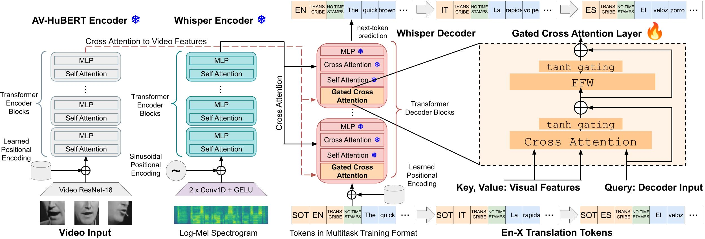
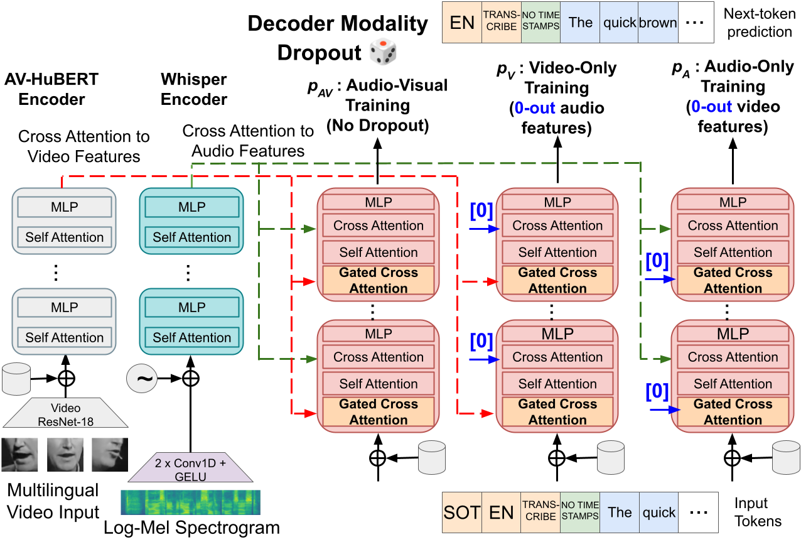

# Whisper-Flamingo and mWhisper-Flamingo

## Updates
**Jan 2025:** We released mWhisper-Flamingo, a SOTA AVSR model for 9 languages! [Paper link](https://arxiv.org/abs/2502.01547).  
**Nov 2024:** We achieved SOTA ASR (1.3\%) and SOTA AVSR (1.4\%) on LRS2 - checkpoints are released below.  
**Oct 2024:** We achieved SOTA ASR (0.68% WER) and SOTA AVSR (0.72% WER) on LRS3 by training on LRS3 and VoxCeleb2 - checkpoints are released below.

## Introduction

[Whisper-Flamingo: Integrating Visual Features into Whisper for Audio-Visual Speech Recognition and Translation](https://arxiv.org/abs/2406.10082)

We propose Whisper-Flamingo which integrates visual features into the Whisper speech recognition and translation model with gated cross attention. 
Our audio-visual Whisper-Flamingo outperforms audio-only Whisper on English speech recognition and En-X translation for 6 languages in noisy conditions.
Moreover, Whisper-Flamingo is a versatile model and conducts all of these tasks using one set of parameters, while prior methods are trained separately on each language.



[mWhisper-Flamingo for Multilingual Audio-Visual Noise-Robust Speech Recognition](https://arxiv.org/abs/2502.01547)

We propose mWhisper-Flamingo for multilingual AVSR. To enable better multi-modal integration and improve the noisy multilingual performance, we introduce decoder modality dropout where the model is trained both on paired audio-visual inputs and separate audio/visual inputs. mWhisper-Flamingo achieves state-of-the-art WER on MuAViC, an AVSR dataset of 9 languages.



# Video Demos
Check out the video demo below (turn sound on).
We made several videos about Whisper-Flamingo:
- 30s demo of Whisper-Flamingo (same video below): [YouTube link](https://youtu.be/EsFlaqYVkro)
- 2m demo comparing Whisper and Whisper-Flamingo: [YouTube link](https://youtu.be/elHF-EQgmNs)
- 10m presentation: [YouTube link](https://youtu.be/MemXz2IqwIM)

<table class="center">
<tr>
    <td width=100% style="border: none">
        <video controls autoplay loop src="https://github.com/roudimit/whisper-flamingo/assets/16767254/7ce5b2c3-4d21-4453-8bd2-8c4977c948f9" muted="false"></video>
    </td>
</tr>
</table>

1m demo of mWhisper-Flamingo (turn sound on). [YouTube link](https://youtu.be/Z6VYvlaErTo).
<table class="center">
<tr>
    <td width=100% style="border: none">
        <video controls autoplay loop src="https://github.com/user-attachments/assets/4852942f-e54d-4bf3-9f28-e038b4edb100" muted="false"></video>
    </td>
</tr>
</table>


# Colab Demos
Whisper-Flamingo Colab notebooks. **Note:** Google Colab updated Python to 3.11, which makes the Fairseq version incompatible and the notebooks might not work anymore. We recommend installing our conda environment locally and running the local versions.
- Test Whisper-Flamingo on an example audio / video [](https://colab.research.google.com/drive/1rnhNOZuUxh-WXXloo_z1fu5DKeJrH95p). Local copy: `notebooks/whisper_flamingo_demo_noise.ipynb`.
- Reproduce our results on LRS3 / MuAViC: [](https://colab.research.google.com/drive/1tYI_7GxJuQdhWnO4m6TUplEoxVaYgbvW). Local copy: `notebooks/whisper_flamingo_demo.ipynb`.

mWhisper-Flamingo notebooks:
- Test mWhisper-Flamingo on an example audio / video (reproduce the demo video): `notebooks/mwhisper_flamingo_demo_noise.ipynb`.
- Reproduce our results on MuAViC Es ASR: `notebooks/mwhisper_flamingo_demo.ipynb`

# Virtual Environment for Training and Testing
Since this project uses the MuAViC dataset, we base our virtual environment on theirs.

Create a fresh virtual environment:
```
conda create -n whisper-flamingo python=3.8 -y
conda activate whisper-flamingo
```
Clone MuAViC repo and install their requirements: 
```
conda install -c conda-forge ffmpeg==4.2.2 -y
conda install -c conda-forge sox -y
git clone https://github.com/facebookresearch/muavic.git muavic-setup
cd muavic-setup
pip install -r requirements.txt
cd ..
```
Clone the "muavic" branch of av_hubert's repo and install Fairseq:
```
# downgrade pip https://github.com/roudimit/whisper-flamingo/issues/4 https://github.com/facebookresearch/fairseq/issues/5511
python -m pip install pip==24.0
pip --version
git clone -b muavic https://github.com/facebookresearch/av_hubert.git
cd av_hubert
git submodule init
git submodule update
# Install av-hubert's requirements
pip install -r requirements.txt
# Install fairseq
cd fairseq
pip install --editable ./
cd ../..
```
Install extra packages used in our project:
```
pip install tiktoken==0.5.2 pytorch-lightning==2.1.3 numba==0.58.1 transformers==4.36.2 evaluate tensorboardX
```

**Important:** to use mWhisper-Flamingo, a minor change is required in the AV-HuBERT code.
Specfically, comment out [line 624](https://github.com/facebookresearch/av_hubert/blob/e8a6d4202c208f1ec10f5d41a66a61f96d1c442f/avhubert/hubert.py#L624) and add this after line 625: `features_audio = torch.zeros_like(features_video)`. This is needed since we only use video inputs with AV-HuBERT, not audio. Otherwise you will get an error about 'NoneType' object. 

# Download and prepare data
LRS3 / MuAViC: We provide all data to reproduce the results on the test set. For instructions on how to prepare the training set (and more details about the test noise), see `preparation/README.md`. For MuAViC non-En, we also provide our text labels which were normalized by removing all punctuation except single apostrophes (the code that we used for text normalization is in `notebooks/mtedx_labels.ipynb`). Note that we normalized all the text (training / validation / test).

Download and extract our resources:
```
wget https://data.csail.mit.edu/public-release-sls/whisper-flamingo/muavic.tar.gz # En
wget https://data.csail.mit.edu/public-release-sls/whisper-flamingo/muavic-multi.tar.gz # Ar, De, El, Es, It, Fr, Pt, Ru
# NOTE: you can also download muavic-ar.tar.gz, muavic-de.tar.gz, etc... if you need a specific language.
wget https://data.csail.mit.edu/public-release-sls/whisper-flamingo/noise.tar.gz
tar -xf muavic.tar.gz
tar -xf muavic-multi.tar.gz
tar -xf noise.tar.gz
echo $(pwd)/noise/babble/muavic/babble_all.wav > ./noise/babble/muavic/test.tsv
echo $(pwd)/noise/babble/muavic/babble_all.wav > ./noise/babble/muavic/valid.tsv
echo $(pwd)/noise/babble/lrs3/noise.wav > ./noise/babble/lrs3/test.tsv
echo $(pwd)/noise/babble/lrs3/noise.wav > ./noise/babble/lrs3/valid.tsv
```

LRS2: The data can be downloaded [here](https://www.robots.ox.ac.uk/~vgg/data/lip_reading/lrs2.html) after signing a license and sending it to the BBC (helper script: `notebooks/lrs2_download.ipynb`). In our experience, it took a week to receive the username & password for the data download. We used the [AutoAVSR scripts](https://github.com/mpc001/auto_avsr/tree/main/preparation) to process LRS2 (using the provided facial landmarks). Finally, the AutoAVSR data lists must be converted to AV-HuBERT / Fairseq manifests. We provide a script to do this (`notebooks/lrs2_make_tsv.ipynb`).

# mWhisper-Flamingo / multilingual Pre-Trained Models
### Audio-only Whisper (fine-tuned on MuAViC with noise)
| Mod. | Size | Parameters | Langs. | Train GPUs | Download Link |
|---|---|---|---|---|---|
| A | Medium | 769M | En, Ar, De, El, Es, It, Fr, Pt, Ru | 4x A6000, 48GB | [whisper_multi-all_medium](https://data.csail.mit.edu/public-release-sls/mwhisper-flamingo/models/whisper_multi-all_medium.pt)  |
| A | Small | 244M | En, Ar, De, El, Es, It, Fr, Pt, Ru | 4x A6000, 48GB | [whisper_multi-all_small](https://data.csail.mit.edu/public-release-sls/mwhisper-flamingo/models/whisper_multi-all_small.pt)   |

### Audio-visual mWhisper-Flamingo
| Mod. | Size | Parameters | Langs. | Train GPUs | Download Link |
|---|---|---|---|---|---|
| A | Medium | 1,390M | En, Ar, De, El, Es, It, Fr, Pt, Ru | 4x A6000, 48GB | [whisper-flamingo_multi-all_medium](https://data.csail.mit.edu/public-release-sls/mwhisper-flamingo/models/whisper-flamingo_multi-all_medium.pt)  |
| A | Small | 651M  | En, Ar, De, El, Es, It, Fr, Pt, Ru | 4x A6000, 48GB | [whisper-flamingo_multi-all_small](https://data.csail.mit.edu/public-release-sls/mwhisper-flamingo/models/whisper-flamingo_multi-all_small.pt)   |

# English Pre-trained Models
We release our pre-trained models (GPUs = GPUs used for training).
- Our audio models are fine-tuned with noise from MUSAN and LRS3 (including babble noise, speech, and music), making them perform better in noise (see the paper and our video demo for more details)
- We also release the models trained on the combination of LRS3 and VoxCeleb2 (the transcripts of VoxCeleb2 were obtained by Whisper Large-V2, available from this [repo](https://github.com/nikvaessen/disjoint-mtl?tab=readme-ov-file)). We release the models fine-tuned with noise (noisy) and without noise (clean). **whisper_en_large_vc2_clean achieves SOTA ASR on LRS3 (0.68% WER) and whisper-flamingo_en_large_vc2_clean achieves SOTA AVSR on LRS3 (0.72% WER).**
- LRS2 models: these models are trained on the LRS2 dataset with noise added from MUSAN and LRS3. **whisper_lrs2_medium achieves SOTA ASR on LRS2 (1.3% WER) and whisper-flamingo_lrs2_medium achieves SOTA AVSR on LRS2 (1.4%)**.
- Our LRS3 models support transcription in English (En) and En-X translation into 6 languages: Greek (El), Spanish (Es), French (Fr), Italian (It), Portuguese (Pt), and Russian (Ru).
Note that to enable the new En-X translation capabilities, we use the 'transcribe' token instead of the 'translate' token as input to the decoder since the latter was already used for X-En translation.
- For English, our models don't output punctuation and capitalization since the LRS3 English training text removed them. For En-X translation, our models output punctuation and capitalization since they were retained in the training translations.


### Audio-only Whisper (fine-tuned on LRS3 / MuAViC)
|   Mod.  |   Size  |   VoxCeleb2 | Parameters  |   En ASR  |   En-X ST  |   GPUs  |   Download Link  |
|---|---|---|---|---|---|---|---|
|   A  |   Large-V2  | yes |   1,550M  |   yes  |   no  |   1x A6000, 48GB  |   noisy: [whisper_en_large_vc2_noisy](https://data.csail.mit.edu/public-release-sls/whisper-flamingo/models/whisper_en_large_vc2_noisy.pt) <br> clean: [whisper_en_large_vc2_clean](https://data.csail.mit.edu/public-release-sls/whisper-flamingo/models/whisper_en_large_vc2_clean.pt) |
|   A  |   Large-V2  | no |   1,550M  |   yes  |   no  |   1x A6000, 48GB  |   [whisper_en_large](https://data.csail.mit.edu/public-release-sls/whisper-flamingo/models/whisper_en_large.pt)  |
|   A  |   Large-V2  | no |   1,550M  |   yes  |   yes  |   4x A6000, 48GB  |   [whisper_en-x_large](https://data.csail.mit.edu/public-release-sls/whisper-flamingo/models/whisper_en-x_large.pt)  |
|   A  |   LRS2-Medium  | no |   769M  |   yes  |   no  |   1x A6000, 48GB  |   [whisper_lrs2_medium](https://data.csail.mit.edu/public-release-sls/whisper-flamingo/models/whisper_lrs2_medium.pt)  |
|   A  |   Medium | no |   769M  |   yes  |   yes  |   4x A5000, 24GB  |   [whisper_en-x_medium](https://data.csail.mit.edu/public-release-sls/whisper-flamingo/models/whisper_en-x_medium.pt)  |
|   A  |   Small  | no |   244M  |   yes  |   yes  |   4x A5000, 24GB  |   [whisper_en-x_small](https://data.csail.mit.edu/public-release-sls/whisper-flamingo/models/whisper_en-x_small.pt)  |

### Audio-visual Whisper-Flamingo
|   Mod.  |   Size  |   VoxCeleb2 | Parameters  |   En ASR  |   En-X ST  |   GPUs  |   Download Link  |
|---|---|---|---|---|---|---|---|
|   AV  |   Large-V2  | yes |    2,497M  |   yes  |   no  |   1x A6000, 48GB  |   noisy: [whisper-flamingo_en_large_vc2_noisy](https://data.csail.mit.edu/public-release-sls/whisper-flamingo/models/whisper-flamingo_en_large_vc2_noisy.pt) <br> clean: [whisper-flamingo_en_large_vc2_clean](https://data.csail.mit.edu/public-release-sls/whisper-flamingo/models/whisper-flamingo_en_large_vc2_clean.pt)   |
|   AV  |   Large-V2  | no |    2,497M  |   yes  |   no  |   1x A6000, 48GB  |   [whisper-flamingo_en_large](https://data.csail.mit.edu/public-release-sls/whisper-flamingo/models/whisper-flamingo_en_large.pt)  |
|   AV  |   Large-V2  | no |    2,497M  |   yes  |   yes  |   4x A6000, 48GB  |   [whisper-flamingo_en-x_large](https://data.csail.mit.edu/public-release-sls/whisper-flamingo/models/whisper-flamingo_en-x_large.pt)  |
|   AV  |   LRS2-Medium  | no |   1,390M  |   yes  |   no  |   1x A6000, 48GB  |   [whisper-flamingo_lrs2_medium](https://data.csail.mit.edu/public-release-sls/whisper-flamingo/models/whisper-flamingo_lrs2_medium.pt)  |
|   AV  |   Medium  | no |   1,390M  |   yes  |   yes  |   4x A6000, 48GB  |   [whisper-flamingo_en-x_medium](https://data.csail.mit.edu/public-release-sls/whisper-flamingo/models/whisper-flamingo_en-x_medium.pt)  |
|   AV  |   Small  | no |    651M  |   yes  |   yes  |   4x A5000, 24GB  |   [whisper-flamingo_en-x_small](https://data.csail.mit.edu/public-release-sls/whisper-flamingo/models/whisper-flamingo_en-x_small.pt)  |

# Decoding Script
### Audio-Only Decoding
First, download our models. Ex: audio-only Whisper model fine-tuned for En-X translation.
```
mkdir models
wget https://data.csail.mit.edu/public-release-sls/whisper-flamingo/models/whisper_en-x_small.pt -P models
```

Decode an audio-only model (see `whisper_decode_video.py` for argument details):
- For this model, to switch to En-X translation, change the `lang` to the target language and use `--task En-X`.
- Here we use babble noise from MuAViC at 0 SNR. Use `noise/babble/lrs3/test.tsv` for babble noise from LRS3. Use `--noise-snr 1000` to evaluate in clean conditions.
- Here use beam size 1. In the paper we report results with beam size 15.
- For GPU without fp16, and for cpu, use `--fp16 0`.
```
python -u whisper_decode_video.py --lang en \
                                --model-type small \
                                --noise-snr 0 \
                                --noise-fn noise/babble/muavic/test.tsv \
                                --modalities asr \
                                --checkpoint-path models/whisper_en-x_small.pt
```

LRS2 ASR decoding (adjust `noise_snr` as desired):
```
python -u whisper_decode_video.py --lang lrs2 \
                                --model-type medium \
                                --noise-snr 1000 \
                                --noise-fn noise/babble/lrs3/test.tsv \
                                --modalities asr \
                                --checkpoint-path models/whisper_lrs2_medium.pt
```

MuAViC Es decoding using our fine-tuned Whisper (you can change Es to any other supported language):
```
python -u whisper_decode_video.py --lang es \
                                --model-type small \
                                --noise-snr 0 \
                                --noise-fn noise/babble/lrs3/test.tsv \
                                --modalities asr \
                                --checkpoint-path models/whisper_multi-all_small.pt
```

### Audio-Visual Decoding
First, download our models. Ex: our audio-visual Whisper-Flamingo model fine-tuned for En-X translation.
Note: the AV-HuBERT weights must be downloaded and are used by Fairseq to load the architecture.
```
mkdir models
wget https://data.csail.mit.edu/public-release-sls/whisper-flamingo/models/whisper-flamingo_en-x_small.pt -P models
wget https://data.csail.mit.edu/public-release-sls/whisper-flamingo/models/large_noise_pt_noise_ft_433h_only_weights.pt -P models
```

Decode an audio-visual model:
```
python -u whisper_decode_video.py --lang en \
                                --model-type small \
                                --noise-snr 0 \
                                --noise-fn noise/babble/muavic/test.tsv \
                                --modalities avsr \
                                --use_av_hubert_encoder 1 \
                                --av_fusion separate \
                                --checkpoint-path models/whisper-flamingo_en-x_small.pt \
                                --av-hubert-path av_hubert/avhubert/ \
                                --av-hubert-ckpt models/large_noise_pt_noise_ft_433h_only_weights.pt
```

LRS2 AVSR decoding (adjust `noise_snr` as desired):
```
python -u whisper_decode_video.py --lang lrs2 \
                                --model-type medium \
                                --noise-snr 1000 \
                                --noise-fn noise/babble/lrs3/test.tsv \
                                --modalities avsr \
                                --use_av_hubert_encoder 1 \
                                --av_fusion separate \
                                --checkpoint-path models/whisper-flamingo_lrs2_medium.pt \
                                --av-hubert-path av_hubert/avhubert/ \
                                --av-hubert-ckpt models/large_noise_pt_noise_ft_433h_only_weights.pt
```

MuAViC Es decoding using mWhisper-Flamingo (you can change Es to any other supported language):
```
# NOTE: run this first to download the multilingual AV-HuBERT weights
wget https://data.csail.mit.edu/public-release-sls/mwhisper-flamingo/models/mavhubert_only_weights.pt -P models
```
```
python -u whisper_decode_video.py --lang es \
                                --model-type small \
                                --noise-snr 0 \
                                --noise-fn noise/babble/lrs3/test.tsv \
                                --modalities avsr \
                                --use_av_hubert_encoder 1 \
                                --av_fusion separate \
                                --checkpoint-path models/whisper-flamingo_multi-all_small.pt \
                                --av-hubert-path av_hubert/avhubert/ \
                                --av-hubert-ckpt models/mavhubert_only_weights.pt
```
                          

# Decoding Script in Parallel with SLURM
We provide `slurm/whisper_decode_wrapper.sh` (En-X) and `slurm/whisper_decode_multi_wrapper.sh` (multilingual ASR) for submitting decoding jobs to SLURM. After submitting all jobs, ie. `source slurm/whisper_decode_wrapper.sh`, use `slurm/check_results.ipynb` or `slurm/multilingual_check_results.ipynb` to print the results of all decoding runs. It will load the decoding WER / BLEU scores and print them in a convinient table.

# Training

### Step 1: Fine-tune audio-only Whisper on MuAViC with noise
First, pick a config from `config/audio/`, for example `config/audio/audio_en-x_large.yaml`. Then replace `noise_fn: '/data/sls/scratch/roudi/datasets/musan/tsv/all/train.tsv'` with the path to your training noise. Training Command:
```
python -u whisper_ft_muavic.py config/audio/audio_en-x_large.yaml
```
We also provide a slurm script in `slurm/train_audio_4gpu.sh` (En-X, multilingual models) and `slurm/train_audio_1gpu.sh` (En models). 
It took about 2-3 days to fine-tune Whisper Large-V2 on our GPUs. 
The medium and small models finish in about a day.

### Step 2: Train audio-visual Whisper-Flamingo with gated cross attention
Once the audio model is fine-tuned, we freeze the weights and insert the gated cross-attention layers to train the audio-visual Whisper-Flamingo. Use the corresponding config in `config/audio-visual/`. Training Command:
```
python -u whisper_ft_muavic_video.py config/audio-visual/av_en-x_large.yaml
```
We also provide a slurm script in `slurm/train_video_4gpu.sh` (En-X, multilingual models) and `slurm/train_video_1gpu.sh` (En models). 
Training Whisper-Flamingo is faster since the cross-attention layers are the only trainable layers. It took about 1 day to train Whisper-Flamingo Large on our GPUs (not including the time to fine-tune the audio model in the first step).

### Training progress
Model weights will be saved in `models/checkpoint`.
Tensorboard can be opened to monitor several metrics.
```
cd slurm
tensorboard --logdir .  --port 6008
```
### Training notes
- Training should work on 1 GPU or multiple GPUs, although some settings need to be adjusted (such as batch size)
- The original Whisper code always pads audio to 30s. We avoid this and instead batch together samples of similar length and pad to the longest sample in the batch (this minimizes padding).


# Acknowledgments
This code based is based on the following repos: [Whisper Fine-Tuning Demo](https://colab.research.google.com/drive/1P4ClLkPmfsaKn2tBbRp0nVjGMRKR-EWz?usp=sharing), [Whisper](https://github.com/openai/whisper), [AV-HuBERT](https://github.com/facebookresearch/av_hubert), [MuAViC](https://github.com/facebookresearch/muavic), [ESPnet](https://github.com/espnet/espnet), [AutoAVSR](https://github.com/mpc001/auto_avsr), [Flamingo-pytorch](https://github.com/lucidrains/flamingo-pytorch), [e-mvsr](https://github.com/JeongHun0716/e-mvsr).


# License
Our work is licensed under BSD-3. However, please check the licenses of the works we build on, including AV-HuBERT.

# Citation
mWhisper-Flamingo - coming soon!

```bibtex
@inproceedings{rouditchenko24_interspeech,
  title     = {Whisper-Flamingo: Integrating Visual Features into Whisper for Audio-Visual Speech Recognition and Translation},
  author    = {Andrew Rouditchenko and Yuan Gong and Samuel Thomas and Leonid Karlinsky and Hilde Kuehne and Rogerio Feris and James Glass},
  year      = {2024},
  booktitle = {Interspeech 2024},
  pages     = {2420--2424},
  doi       = {10.21437/Interspeech.2024-322},
  issn      = {2958-1796},
}
```
